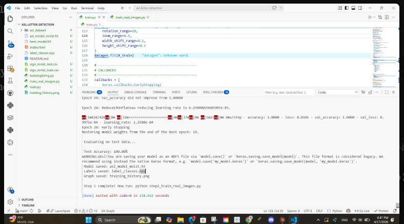
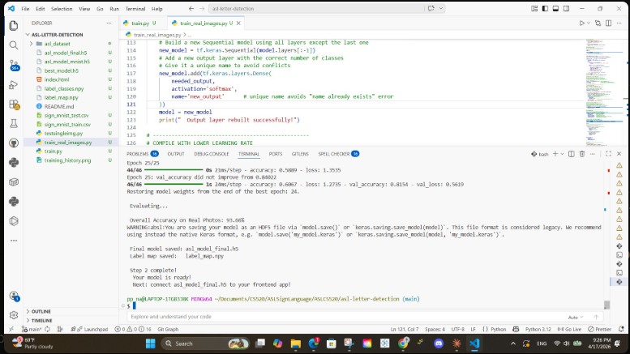
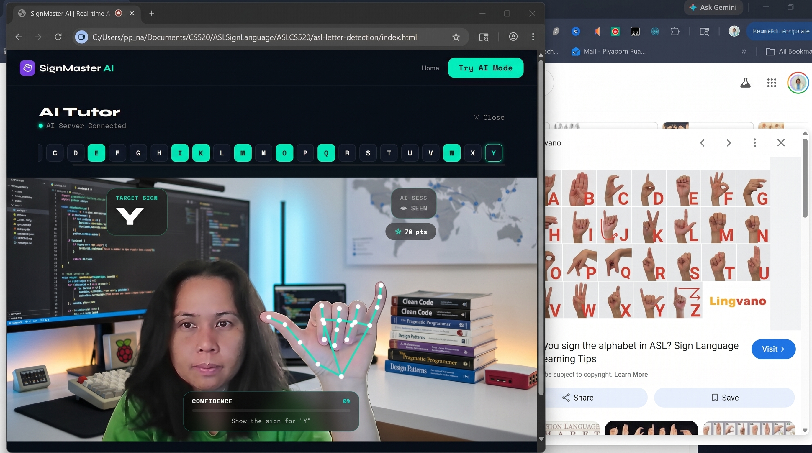

# asl-letter-detection
The index2.html is not linked to the training file. It's too easy to pass all the letter tests. from JS @mediapipe
1. Download sign_mnist_test and train.csv
2. Download the asl_dataset from your 70 pictures/ letter file
3. Run train.py => you will get asl_model_mnist.h5

5. Run train_real_images.py. Then
6. Run testsingleimg.py
   --------------
7. Run server.py, then run index.html
   -------------------
   The result is hard to get correct compared with index2.html

